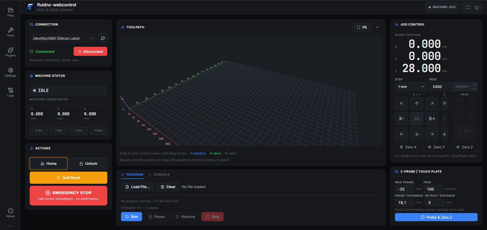
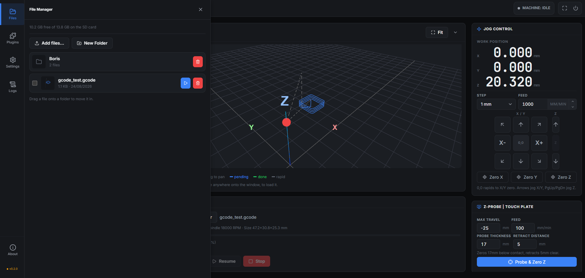
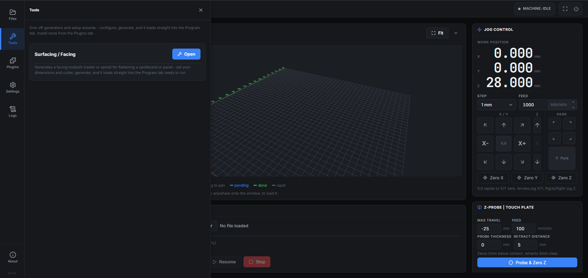
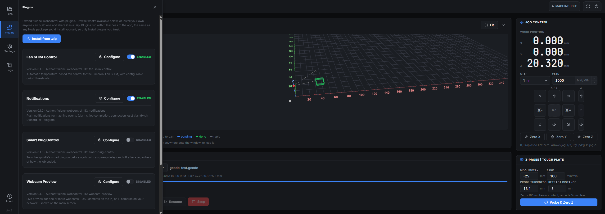
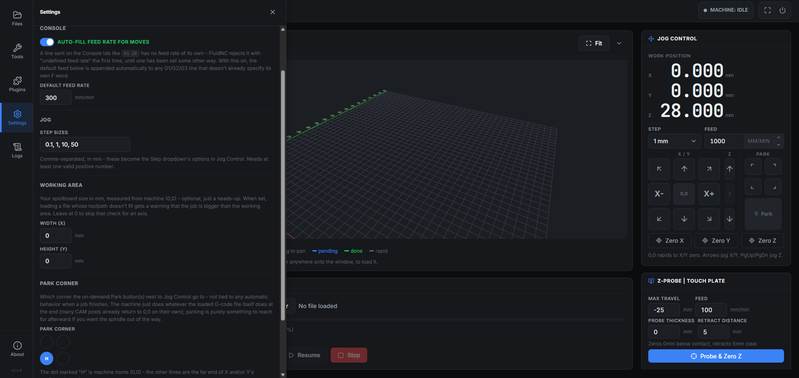
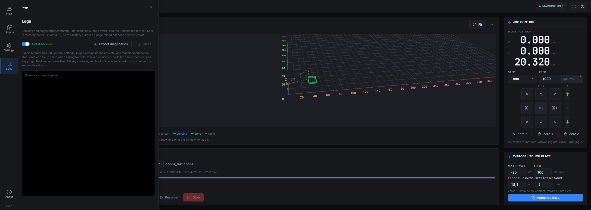
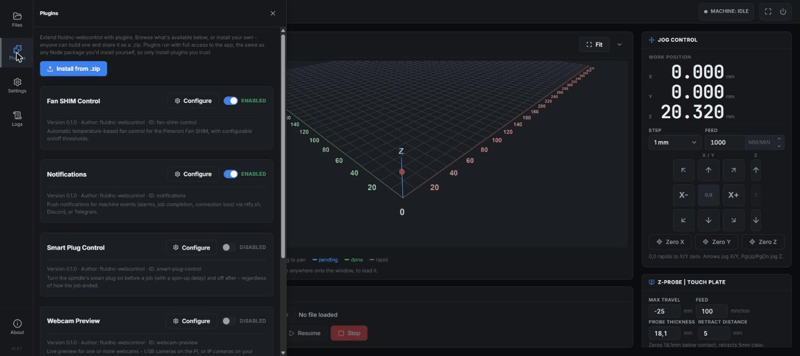

# fluidnc-webcontrol

A free, open-source (MIT), community-driven web control UI for [FluidNC](https://github.com/bdring/FluidNC)-based CNC controllers.

**Status: working MVP.** Connect, jog, home, probe (with plate-thickness correction), load and stream G-code with a live 3D toolpath preview, pause/resume/stop — validated against real FluidNC hardware. Extensible through a plugin system: browse and one-click install from a public index right in the app, or drop in your own `.zip`. Fan control, push notifications, smart-plug automation, a webcam preview, and touch-plate Z-probing all ship as plugins today. Still no native spindle/laser control (M3/M4/M5) in the core app.

This project is an independent community effort and is not affiliated with or endorsed by the FluidNC project, Bart Dring, or any controller manufacturer.

📖 **[Full user guide, plugin docs, and troubleshooting → the wiki](https://github.com/MP3DPT/fluidnc-webcontrol/wiki)**

> **Before you start:** your controller must already be running FluidNC firmware with a working `config.yaml` for your machine. This is a web control interface for an *existing, already-configured* FluidNC setup — it does not flash firmware or write machine configuration for you. Haven't set that up yet? See [FluidNC's own documentation](http://wiki.fluidnc.com/en/home) first.

| Main screen | File Manager | Tools |
|---|---|---|
|  |  |  |

| Plugins | Settings | Logs |
|---|---|---|
|  |  |  |

## Demo



A tour of the sidebar (Tools, Plugins, Settings, Logs, About), generating a facing toolpath with the Surfacing/Facing tool, then in the File Manager hovering a file's thumbnail for a full-size toolpath preview and job info (size, time, feed, spindle, tool, line count) before loading and streaming it start to finish on a real PiBot V4.96 PRO — live toolpath, live coordinates, live machine state throughout. Recorded as a bare-machine test run (no endmill installed, Smart Plug Control disabled so the spindle never powers on) rather than an actual cut.

## Why this exists

Existing FluidNC senders fall into two camps:
- FluidNC's own bundled WebUI, which is functional but dated and has no toolpath preview.
- Popular modern senders (gSender, etc.) that are built for plain GRBL/grblHAL and only unofficially, partially support FluidNC — with real, documented bugs around settings sync, homing, and soft limits.

The goal here is a UI that is **FluidNC-native from the start** — built against FluidNC's actual protocol and state machine, not retrofitted from GRBL assumptions — with a modern look, a real toolpath preview, and an addon system so the community can extend it, in the spirit of OctoPrint's plugin ecosystem.

## Architecture

```
┌─────────────┐   USB serial    ┌──────────────┐   WebSocket    ┌──────────────┐
│  PiBot /     │◄───────────────►│  Backend      │◄──────────────►│  Any browser │
│  FluidNC     │   115200 baud   │  (Node.js,    │   ws://.../ws  │  on the LAN  │
│  board       │                 │  on a Pi)     │                │  (phone,     │
└─────────────┘                 └──────────────┘                │  tablet, PC) │
                                                                  └──────────────┘
```

The backend owns the serial connection and speaks FluidNC's line protocol directly (see `backend/src/serial/`). It never runs on the end user's own computer — only on the Raspberry Pi (or any small Linux box) wired to the controller — so nothing about the end user's machine is touched. Any browser on the network can connect to it, same deployment model as CNCjs.

- `backend/` — Node.js + TypeScript. Owns the serial port, parses status reports, exposes a WebSocket API.
- `frontend/` — React + TypeScript (Vite). The UI, talks to the backend over WebSocket.

### Streaming safety

The command queue in `backend/src/serial/connection.ts` sends one line and waits for FluidNC's `ok`/`error` before sending the next. This is the conservative version of the Grbl streaming protocol — slower than character-counting streaming, but it cannot overrun the controller's planner buffer, which is the class of bug that has affected other senders paired with FluidNC. Optimizing this later (character-counting protocol) is a good first contribution once the basics are proven solid.

## Hardware

Built and tested on a **Raspberry Pi 4**, paired with a PiBot V4.96 PRO (FluidNC) controller board over USB serial — but works with any FluidNC-based controller and machine: routers, mills, laser or plasma setups.

The pre-flashed image is **64-bit** Raspberry Pi OS (confirmed `aarch64` on the hardware it's tested on), which matters for older/smaller boards:

- **Raspberry Pi 3** — architecturally compatible (64-bit-capable Cortex-A53), untested by us but the backend is lightweight (Node.js/Express/WebSockets) and expected to run the whole app comfortably.
- **Raspberry Pi Zero 2 W** — a different, newer board than the original Zero W: quad-core, same chip family as the Pi 3, also 64-bit-capable. Untested by us; plausible for the core app (jog/stream/monitor), but its 512MB RAM (half the Pi 3's 1GB) is reason enough to skip the webcam plugin there.
- **Original Raspberry Pi Zero W will not work at all.** Its single-core ARMv6 chip has no 64-bit support, so this image simply won't boot — not a performance limitation, an architecture one.

## Plugins

Anything FluidNC can't know about your specific shop — a cooling fan, a phone notification, a smart plug wired to the spindle, a webcam — lives in a plugin instead of the core app. A plugin is just a folder with a `plugin.json` manifest and an entry module, loaded from `~/.fluidnc-webcontrol/plugins` at runtime (see `backend/src/plugins/loader.ts`); installing one is a normal in-app action, no rebuild or restart needed.

Open the **Plugins** tab in the sidebar to:
- **Browse** what's available — the app fetches [`plugins.json`](plugins.json) from this repo and lists anything you don't already have installed, one click to install. This needs the Pi to have internet access, since it's reaching out to GitHub.
- **Install from a `.zip`** manually, for a plugin you built yourself, got somewhere else, or grabbed on another device — this works with no internet at all, which matters since running the CNC itself (jogging, streaming G-code) never needs internet either, only a local network between the Pi and your browser. If Browse can't reach the index, the app tells you so and points at this instead.

Shipped today (wiki links include setup steps and troubleshooting):

| Plugin | What it does | Setup |
|---|---|---|
| Fan SHIM Control | Temperature-based fan control for the Pimoroni Fan SHIM | Needs `gpiod` — already installed by `install.sh` |
| Notifications | Pushes alarms, job-completion, and connection-loss events to ntfy.sh, Discord, or Telegram | [Needs a provider account](https://github.com/MP3DPT/fluidnc-webcontrol/wiki/Plugin-Notifications) |
| Smart Plug Control | Turns the spindle's smart plug on before a job (with a spin-up delay) and off after, regardless of how the job ended | [Needs a one-time Tuya key extraction](https://github.com/MP3DPT/fluidnc-webcontrol/wiki/Plugin-Smart-Plug-Control) |
| Surfacing / Facing | On-demand G-code generator (Tools tab) for wasteboard/spoilboard surfacing - raster or spiral, target-depth or full-wasteboard mode | None — open it from the Tools tab and generate |
| Webcam Preview | Live preview for one or more USB or IP webcams on the main screen | Needs `ffmpeg` + `v4l-utils` — already installed by `install.sh` |
| Z-Probe \| Touch Plate | Touch-plate Z probing with plate-thickness correction | [None — just enter your plate's dimensions](https://github.com/MP3DPT/fluidnc-webcontrol/wiki/Plugin-Z-Probe-Touch-Plate) |

See the wiki's [Plugins overview](https://github.com/MP3DPT/fluidnc-webcontrol/wiki/Plugins) for the full picture, and [Writing a Plugin](https://github.com/MP3DPT/fluidnc-webcontrol/wiki/Writing-a-Plugin) for the complete `PluginContext` API if you want to build your own. Short version: a plugin gets a `PluginContext` — the serial connection, the program runner, its own settings store, `registerBeforeRun`/`registerAction` hooks, and its own Express router under `/api/plugins/<id>`. Any folder under [`plugins/`](plugins) is a working example; `backend/src/plugins/types.ts` has the exact interface.

If you're editing one of *this repo's own bundled* plugins, run `npm run sync-plugins` afterward - `plugins/<id>/` is just the editable source, and both `plugins/<id>.zip` (what Browse actually installs) and `backend/plugins-bundled/<id>/` (what a fresh install copies in) are separate generated copies that won't update themselves. `npm run sync-plugins:check` (non-destructive) is what CI/a pre-commit hook would run to catch a forgotten sync.

## Running it on a Raspberry Pi

For a step-by-step walkthrough (including first connection and what to do next), see the wiki's [Getting Started](https://github.com/MP3DPT/fluidnc-webcontrol/wiki/Getting-Started) page. Short version below.

### Pre-flashed SD card image (fastest)

Skip the install entirely: download the pre-flashed image from the [v0.4.8 release](https://github.com/MP3DPT/fluidnc-webcontrol/releases/tag/v0.4.8) ([`fluidnc-webcontrol-v0.4.8.img.xz`](https://github.com/MP3DPT/fluidnc-webcontrol/releases/download/v0.4.8/fluidnc-webcontrol-v0.4.8.img.xz), ~736MB) and flash it with [Raspberry Pi Imager](https://www.raspberrypi.com/software/) using "Use custom" to select the `.img.xz` directly - it decompresses automatically, no OS customization step needed, SSH is already enabled.

This image includes the in-app auto-updater (Settings → About → "Update now"), so future releases generally won't need a fresh image at all - see the release notes, or the wiki's [Updating the App](https://github.com/MP3DPT/fluidnc-webcontrol/wiki/Updating-the-App), for what does still warrant one.

- **Default login: `pi` / `raspberry` - change this password immediately after your first login** (`passwd`), same as you would for any device shipped with a known default.
- After first boot, open `http://<pi-ip-address>:8000` from any browser on the network - no install step required.
- That `pi` login is just for SSH/console access to the Pi itself - the app runs under its own dedicated system account, so renaming `pi`, changing its password, or switching to key-only SSH afterward won't affect the web UI at all.

See [docs/building-the-image.md](docs/building-the-image.md) if you want to build this image yourself instead of trusting the published one.

### Quick install (on your own Pi OS install)

```bash
git clone https://github.com/MP3DPT/fluidnc-webcontrol.git
cd fluidnc-webcontrol
sudo ./scripts/install.sh
```

This is the whole setup: Node.js via nvm, the `dialout` group for serial access, dependencies + build, a scoped sudoers entry for the header's Reboot/Shutdown buttons and the in-app "Update now" button's own restart (see [`scripts/install.sh`](scripts/install.sh) for exactly what it does - it only ever grants `/sbin/shutdown` and `systemctl restart fluidnc-webcontrol`, nothing else), and a systemd service so it starts automatically on boot and restarts on crash. Run it yourself with `sudo` - deliberately not something automated on your behalf, since it touches sudoers and systemd.

Then connect the PiBot via USB and open `http://<pi-ip-address>:8000` from any browser on the network.

Want to try it out before running a real job? [`samples/gcode_test.gcode`](samples/gcode_test.gcode) is a small, safe test cut - good for a first Run, or for checking a plugin fires correctly.

### Manual install

If you'd rather not run the installer (or want it as a one-off foreground process instead of a systemd service):

1. **Install Node.js 20 LTS** via [nvm](https://github.com/nvm-sh/nvm) or your distro's package manager.
2. **Add your user to the `dialout` group** (needed to access `/dev/ttyUSB0` without root):
   ```bash
   sudo usermod -a -G dialout $USER
   ```
   Log out and back in for this to take effect.
3. **Install dependencies and run:**
   ```bash
   npm install
   npm start
   ```
   This builds the frontend, builds the backend, and starts the server on port 8000 (won't survive a reboot or restart itself on crash - that's what the systemd service from the installer gives you).
4. **(Optional) Allow the header's Reboot/Shutdown buttons and in-app updates** by adding a scoped sudoers entry yourself:
   ```bash
   echo "$USER ALL=(ALL) NOPASSWD: /sbin/shutdown, /bin/systemctl restart fluidnc-webcontrol" | sudo tee /etc/sudoers.d/fluidnc-webcontrol
   sudo chmod 440 /etc/sudoers.d/fluidnc-webcontrol
   ```
   Already installed and only have the old `/sbin/shutdown`-only version of this file from before in-app updates existed? Re-run the same two lines above (or `sudo visudo -f /etc/sudoers.d/fluidnc-webcontrol` and add `, /bin/systemctl restart fluidnc-webcontrol` to the end of the existing line) - the "Update now" button in About will otherwise download and build the new version successfully but fail at the very last step trying to restart the service.

For active development (auto-reload), run the backend and frontend dev servers in two terminals instead:
```bash
npm run dev:backend    # backend on :8000
npm run dev:frontend   # frontend on :5173, proxies /ws and /api to :8000
```

## Roadmap (rough)

- [x] Serial connection + status/pin reporting
- [x] Jog (including diagonal multi-axis) / home / unlock / soft reset
- [x] Z-probe with plate-thickness correction + retract, `[PRB:...]` result parsing
- [x] G-code file upload + streaming with pause/resume/stop and progress
- [x] Toolpath preview (full 3D, orbit/pan/zoom, live executed/pending coloring)
- [x] Settings persisted on the Pi (survives reloads and reboots, synced across browsers)
- [x] Reboot/shutdown from the UI (requires a one-time sudoers step, see setup above)
- [x] Addon/plugin API (backend hooks + frontend panel registration) - see [Plugins](#plugins)
- [x] Browsable plugin index with one-click install straight from a GitHub repo
- [x] One-click plugin updates when a newer version is available in the index
- [x] In-app updates, app and plugins together, no SSH needed - see what's new, confirm, and it downloads/builds/restarts itself (a short service restart, not a full reboot); optionally bundles any outdated plugins into the same restart
- [x] Backend/plugin error log viewer, with a diagnostics export for bug reports (redacts credentials automatically)
- [x] Settings + plugin config backup/restore - export before reinstalling on a new device, or just to have a copy
- [x] Jog step sizes are user-configurable (Settings), not a fixed list
- [x] Toolpath grid auto-fits the loaded job, with a numbered ruler anchored at machine (0,0)
- [x] Configurable working area (spoilboard) size, with a warning when a loaded job doesn't fit
- [ ] Native spindle/laser control (M3/M4/M5 + speed) - no G-code spindle control yet; Smart Plug Control covers on/off via a smart plug in the meantime
- [ ] Feed/spindle override sliders during a running job
- [ ] Alarm recovery UX (currently just a status badge, no guided recovery)
- [ ] WiFi/telnet transport (not just USB)

## Contributing

This is genuinely intended as a community project — issues, PRs, and design opinions are all welcome. If you're picking this up: the serial protocol layer (`backend/src/serial/`) is the part that most needs real-hardware testing across different FluidNC configs, since that's exactly where prior tools have had bugs.

## License

MIT — see [LICENSE](LICENSE). Do whatever you want with it, including forking, selling support for it, or building something better.
